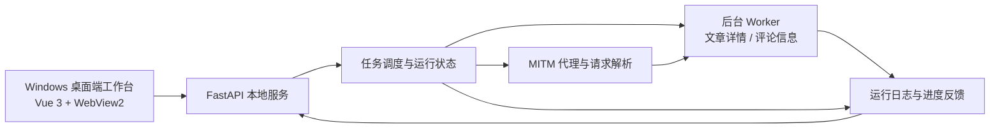
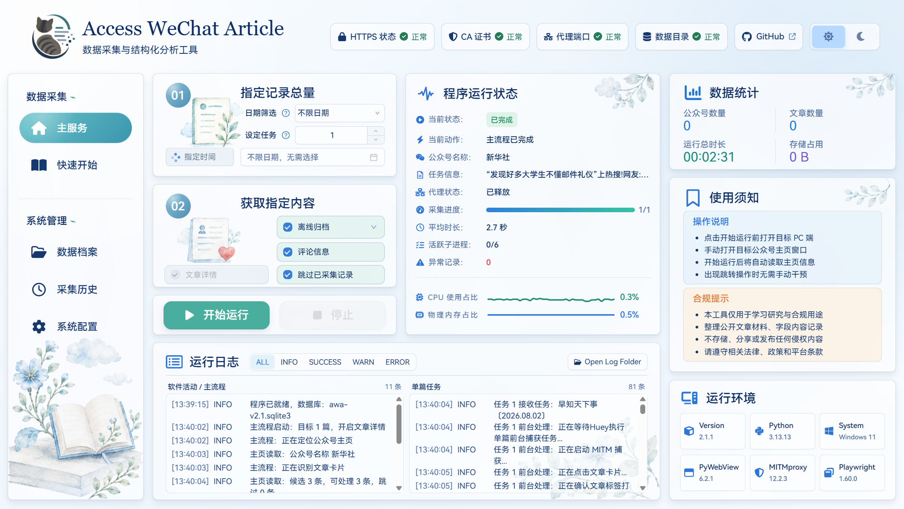

<h1 align="center">Access WeChat Article</h1>

<p align="center">
  <strong>面向学术研究与公开文章材料整理的科研辅助工具</strong>
</p>

<p align="center">
  <span style="color: #6b7280; text-decoration: underline;">简体中文</span> | <a href="./doc/README_en.md">English</a>
</p>
<p align="center">
  
  
  
  
  <a href="https://linux.do/"></a>
  <a href="https://zread.ai/yeximm/Access_wechat_article"></a>
  <a href="./doc/quick_start.md"></a>
</p>

<p align="center">
  
</p>

---

**Access_WeChat_Article** 是一种基于Python 的技术工具，用于辅助研究人员系统性地处理微信公众号公开文章及其元数据（如阅读趋势、互动指标等）。该工具强调**可控性、可复现性与科研可用性**，可用于传播学、社会科学、公共舆论、数据挖掘等领域的**学术研究**与**定量分析**。

它希望为传播学、社会科学、公共议题研究、内容分析和数据挖掘工作提供一个更清晰、可复核、可持续维护的研究材料工作台，帮助研究者把公开文章材料整理、字段记录和后续分析准备放在同一套流程中完成。

>  📌**注意事项**
>
>  本项目为科研辅助工具，面向学术研究、课程项目和个人学习场景。
>
>  使用者应遵守微信平台服务协议、《网络安全法》及相关法律法规，合理处理公开文章材料、引用方式和研究结果。
>
>  使用过程中涉及的法律、平台规则和研究伦理责任由使用者自行承担。

---

## 📦 开发指南与贡献方式

本项目 v2 版本仅支持 **Windows** 环境，主要面向 Windows 10/11 桌面端使用与开发。Linux、macOS 暂不作为 v2 版本的支持环境。

如需研究、修改或二次开发本项目，请先 **Fork** 仓库，再在自己的分支中进行实验。建议使用项目根目录下的 `.venv` 虚拟环境运行和安装依赖，避免影响系统 Python 或其他项目环境。

欢迎围绕桌面端交互、MITM 采集流程、字段结构化、任务调度、研究流程和性能优化等方向进行讨论与改进：

- 提交 [issues](https://github.com/yeximm/Access_wechat_article/issues) 讨论问题、需求或技术细节。
- 提交 pull request 优化代码、文档、测试或运行流程。
- 引入自动化测试、类型检查或 CI/CD 流水线，提升项目质量和可维护性。

**注**：问题反馈和贡献讨论请优先在 [GitHub](https://github.com/) 平台通过 [issues](https://github.com/yeximm/Access_wechat_article/issues) 进行，参考 [贡献与 Issue 反馈指南](doc\contributing.md)。

---

## ✨ 核心亮点

- **面向学术研究场景** —— 服务传播学、社会科学、公共议题研究、内容分析、课程论文和课题项目中的公开文章材料整理工作。
- **结构化研究字段** —— 围绕账号、标题、发布时间、链接、互动指标、任务状态等字段建立统一记录方式。
- **研究流程可追踪** —— 将样本选择、材料整理、任务进度和异常状态放在同一套流程中管理。
- **后续分析友好** —— 整理后的记录可继续用于人工编码、主题标注、统计汇总、文本处理和论文材料核对。
- **Windows 桌面端工作台** —— 基于 WebView2，提供更直观的任务配置、运行状态和历史记录查看方式。

<table>
  <tr>
    <td width="50%">
      <strong>📚 公开文章材料整理</strong><br>
      面向传播学、社会科学、公共议题研究等场景，将微信公众号公开文章的标题、账号、发布时间、短链接和采集状态整理为可复核的研究材料记录。
    </td>
    <td width="50%">
      <strong>🧾 研究字段结构化</strong><br>
      围绕文章详情、互动指标、采集时间、任务结果和耗时信息建立统一字段，便于后续筛选、编码、统计汇总和论文材料核对。
    </td>
  </tr>
  <tr>
    <td width="50%">
      <strong>📈 互动指标记录</strong><br>
      围绕阅读、点赞、推荐、留言等可用于传播表现分析的指标建立记录入口，为描述性统计、趋势观察和样本比较提供基础字段。
    </td>
    <td width="50%">
      <strong>📊 任务进度与异常记录</strong><br>
      通过状态字段和运行记录区分已保存、失败、待复核等情况，减少重复整理、漏记和人工追踪成本。
    </td>
  </tr>
  <tr>
    <td width="50%">
      <strong>🧪 后续分析准备</strong><br>
      让整理后的材料可继续服务于内容分析、人工编码、主题标注、文本清洗、描述统计和论文写作前的数据准备。
    </td>
    <td width="50%">
      <strong>🖥️ Windows 桌面端工作台</strong><br>
      以 Windows 本地桌面应用组织任务配置、运行状态、历史记录和系统设置，降低研究者长期操作命令行的使用门槛。
    </td>
  </tr>
</table>

---

## 🚀 快速开始

本项目 v2 版本仅支持 **Windows 10/11**，Python 环境使用 `uv` 管理。

```bash
git clone https://github.com/yeximm/Access_wechat_article.git
cd Access_wechat_article
uv sync
```

安装 Playwright Chromium 浏览器到项目目录：

```powershell
$env:PLAYWRIGHT_BROWSERS_PATH=".playwright-browsers"
uv run playwright install chromium
```

启动桌面程序：

```bash
uv run python main.py
```

程序启动后，也可以在浏览器访问本地网页端：

```text
http://127.0.0.1:8766/
```

完整安装步骤请看 [`安装说明`](./doc/install.md)，功能说明请看 [`功能说明`](./doc/features.md)。

---

## 🧭 可视化工作流

这一部分用于展示程序的总体运行链路。 

Mermaid 图展示程序核心模块之间的调用关系。



架构图更直观地展示桌面端、后端服务、代理解析、后台任务和页面展示之间的协作方式。

<p align="center">
  
  <br>
  <sub>Access WeChat Article 总体工作流架构图</sub>
</p>

---

## 🧩 功能概览

这里用于展示软件实际运行页面。

### 主服务：任务配置与运行监控

主服务页用于配置采集数量、选择采集内容、启动或停止任务，并查看公众号识别结果、任务进度、代理状态、网络速率和实时运行日志。

<p align="center">
  
</p>


### 数据档案：公众号列表与记录详情

数据档案页用于查看公众号维度的材料列表、采集更新时间、文章数量、记录详情和快速操作，适合对已经整理的材料进行浏览、筛选和维护。

<p align="center">
  
</p>


### 采集历史：记录检索与统计概览

采集历史页用于按关键词、采集类型、任务状态和日期筛选历史记录，并查看记录详情、成功率、最近采集日期和近日采集趋势。

<p align="center">
  
</p>


### 系统配置：运行环境与代理设置

系统配置页用于管理基础配置、代理开关、系统代理、CA 证书、环境检查和缓存清理等运行参数，方便在 Windows 桌面端完成常见维护操作。

<p align="center">
  
</p>


---

## 🤝 支持与鼓励

开源不易，若此项目有帮到你，望你能动用你的发财小手 **Star** ☆ 一下。

十分感谢大家对于本项目的关注,如在使用或阅读代码时遇到问题，欢迎一起讨论。

你的鼓励，是这个项目持续更新的最大动力！

<p align="center">
  
</p>


---

## 📄 License

本项目采用许可协议 [`CC BY-NC-SA 4.0`](https://creativecommons.org/licenses/by-nc-sa/4.0/)，完整条款请参考：[Creative Commons Attribution-NonCommercial-ShareAlike 4.0 International](https://creativecommons.org/licenses/by-nc-sa/4.0/) 。

请在查看、使用、复制、修改或二次开发本仓库内容前，仔细阅读许可证与本声明。一旦使用本仓库内容，即视为已理解并接受相关约束。

- 本项目内容的使用、修改和分发应遵守 `CC BY-NC-SA 4.0` 许可协议及相关法律法规。
- 基于本仓库内容进行的修改、扩展、部署、分发或二次开发，均属于使用者或第三方的自主行为，由此产生的后果由相关使用者自行承担。
- 本仓库中涉及的第三方软件、硬件、平台或工具，仅用于说明项目运行环境或技术背景，不代表本项目作者对其进行推荐、背书或提供使用保证。
- 使用任何第三方软件、硬件、平台或工具所产生的风险、责任和后果，均由实际使用者自行承担，与本项目作者无关。