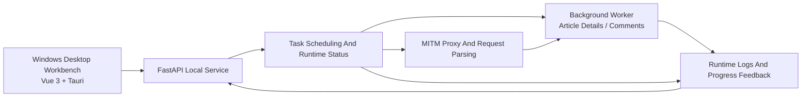

<h1 align="center">Access WeChat Article</h1>

<p align="center">
  <strong>A research assistant for academic work and public article material management</strong>
</p>

<p align="center">
  <a href="../README.md">简体中文</a> | <span style="color: #6b7280; text-decoration: underline;">English</span>
</p>

<p align="center">
  
  
  
  
  <a href="https://linux.do/"></a>
  <a href="https://zread.ai/yeximm/Access_wechat_article"></a>
  <a href="./quick_start.md"></a>
</p>

<p align="center">
  
</p>

---

**Access_WeChat_Article** is a Python-based technical tool for helping researchers systematically process public WeChat articles and their metadata, such as reading trends and engagement metrics. The tool emphasizes **controllability, reproducibility, and research usability**, and can support **academic research** and **quantitative analysis** in communication studies, social science, public opinion research, data mining, and related fields.

It aims to provide a clearer, verifiable, and maintainable research material workbench for communication studies, social science, public issue research, content analysis, and data mining. Researchers can use one workflow to organize public article materials, record fields, and prepare later analysis.

> 📌 **Notice**
>
> This project is intended for academic research, coursework, and personal learning scenarios.
>
> Users should comply with WeChat platform rules, applicable laws, and research ethics when processing public article materials, citations, and research outputs.
>
> Legal, platform, and ethical responsibilities arising from use of this project are borne by the user.

---

## 📦 Development And Contribution

The v2 release currently supports **Windows** only, mainly Windows 10/11 desktop usage and local development. Linux and macOS are not target environments for v2.

If you want to study, modify, or extend this project, please fork the repository first and work on your own branch. It is recommended to use the `.venv` virtual environment under the project root for runtime and dependency installation, so the system Python environment and other projects are not affected.

Contributions are welcome in these areas:

- Submit [issues](https://github.com/yeximm/Access_wechat_article/issues) to discuss problems, requirements, or technical details.
- Submit pull requests to improve code, documentation, tests, or runtime workflows.
- Introduce automated tests, type checks, or CI/CD pipelines to improve project quality and maintainability.

**Note**: Please use [GitHub](https://github.com/) [issues](https://github.com/yeximm/Access_wechat_article/issues) for problem reports and contribution discussions whenever possible. See the [Contribution And Issue Guide](./contributing_en.md).

---

## ✨ Highlights

- **Research-oriented workflow**: Designed for public article material management in communication studies, social science, public issue research, content analysis, course papers, and research projects.
- **Structured research fields**: Records account name, title, publication time, short link, engagement metrics, task status, and related metadata.
- **Traceable collection process**: Keeps sample selection, material organization, task progress, and failure states in one local workflow.
- **Analysis-ready records**: Prepares collected materials for manual coding, topic labeling, statistical summaries, text processing, and paper writing.
- **Windows desktop workbench**: Builds the interface with Vue 3 and is being prepared for Tauri desktop packaging.

<table>
  <tr>
    <td width="50%">
      <strong>📚 Public Article Material Management</strong><br>
      Organize public WeChat article titles, account names, publication times, short links, and collection status into reusable research records.
    </td>
    <td width="50%">
      <strong>🧾 Structured Research Metadata</strong><br>
      Build consistent fields around article details, engagement metrics, collection time, task result, and duration.
    </td>
  </tr>
  <tr>
    <td width="50%">
      <strong>📈 Engagement Metrics</strong><br>
      Record available reading, like, recommendation, comment, and other metrics for communication performance analysis.
    </td>
    <td width="50%">
      <strong>📊 Task Progress And Failure Records</strong><br>
      Use status fields and runtime logs to reduce repeated manual checks and missing records.
    </td>
  </tr>
  <tr>
    <td width="50%">
      <strong>🧪 Analysis Preparation</strong><br>
      Prepare collected materials for content analysis, manual coding, topic labeling, text cleaning, and descriptive statistics.
    </td>
    <td width="50%">
      <strong>🖥️ Windows Desktop Workbench</strong><br>
      Manage task configuration, runtime status, history records, and system settings through a local desktop application.
    </td>
  </tr>
</table>

---

## 🚀 Quick Start

Access WeChat Article v2 currently supports **Windows 10/11**. Python dependencies are managed with `uv`.

```bash
git clone https://github.com/yeximm/Access_wechat_article.git
cd Access_wechat_article
uv sync
```

Install Playwright Chromium into the project directory:

```powershell
$env:PLAYWRIGHT_BROWSERS_PATH=".playwright-browsers"
uv run playwright install chromium
```

Start the local API backend:

```bash
uv run python dev_server.py
```

`main.py` is kept as a compatibility entrypoint and delegates to the same backend service. After startup, the local web interface is also available at:

```text
http://127.0.0.1:8766/
```

For full setup instructions, see [Installation Guide](./install_en.md). For feature details, see [Feature Guide](./features_en.md).

---

## 🧭 Visual Workflow

This section shows the overall runtime flow. The Mermaid diagram describes how the core modules work together.



The architecture image provides a more visual view of the collaboration between the desktop client, backend service, proxy parser, background tasks, and UI.

<p align="center">
  
  <sub>Access WeChat Article overall workflow architecture</sub>
</p>

---

## 🧩 Feature Overview

This section shows the main application pages.

### Main Service: Task Configuration And Runtime Monitoring

The main service page is used to set collection count, select collection content, start or stop tasks, and view account recognition results, task progress, proxy status, network speed, and runtime logs.

<p align="center">
  
</p>

### Data Archive: Account List And Record Details

The data archive page is used to browse account-level material lists, article counts, update times, record details, archive status, and quick operations.

<p align="center">
  
</p>

### Collection History: Search And Summary

The history page is used to filter records by keyword, collection type, task status, and date, and to view record details, success rate, latest collection date, and recent trends.

<p align="center">
  
</p>

### System Settings: Runtime And Proxy Configuration

The settings page is used to manage base configuration, proxy switches, system proxy, CA certificates, environment checks, and cache cleanup.

<p align="center">
  
</p>

---

## 🤝 Support

If this project helps your research workflow, a GitHub Star is appreciated.

For questions, feature requests, or discussions, please use GitHub Issues.

<p align="center">
  
</p>

---

## 📄 License

This project uses the [`CC BY-NC-SA 4.0`](https://creativecommons.org/licenses/by-nc-sa/4.0/) license. For the full terms, see the [Creative Commons Attribution-NonCommercial-ShareAlike 4.0 International](https://creativecommons.org/licenses/by-nc-sa/4.0/) license.

Please read the license and project notice carefully before viewing, using, copying, modifying, or redistributing the repository content.

- Use, modification, and distribution of this project should comply with `CC BY-NC-SA 4.0` and applicable laws.
- Any modification, extension, deployment, distribution, or secondary development based on this repository is the responsibility of the user or third party.
- Third-party software, hardware, platforms, or tools mentioned in this repository are only used to describe the runtime environment or technical background.
- Risks and consequences arising from the use of third-party software, hardware, platforms, or tools are borne by the actual user.
